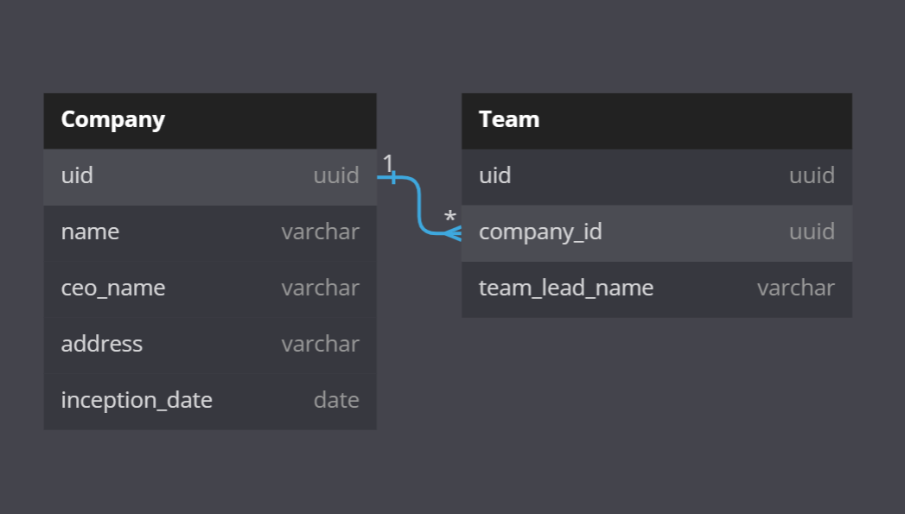

# Company API

### Django Rest Framework Application to expose a few API's , accessible using JWT Token having Postgres as database

## Prerequisite

### [Docker](https://docs.docker.com/get-docker/)

## How To Run

### 1. Clone Repository

```sh
git clone https://github.com/piyushdevcode/companyAPI
```

### 2. Build and start server at http://localhost:8000

```sh
docker-compose up --build
```

# To run tests

### while the docker container is running

```sh
docker-compose exec web python manage.py test
```

# API

### API Root - http://127.0.0.1:8000/api/
#### Note: Before accessing browsable API make sure to [configure](#to-access-browsable-api) token in request header

| End Point                        | HTTP Method | Result                                                   | Accessible by | Browsable API URL Examples|
| -------------------------------- | ----------- | -------------------------------------------------------- | ------------- | ------ |
| `token/`                         | POST        | get the JWT authentication token                         | Anyone        | [get token](http://localhost:8000/api/token/)|
| `companies/`                     | GET         | list all companies                                       | SuperAdmin    |[list all companies](http://127.0.0.1:8000/api/company/)|
| `companies/<uuid:company_id>/`   | GET         | retrieve specific company info                           | SuperAdmin    |[ a company Instance](http://127.0.0.1:8000/api/company/7575a69a-2f7a-4929-83d2-13a7ac0dc715/)|
| `companies/`                     | POST        | create a new company                                     | SuperAdmin    |[create a new company](http://127.0.0.1:8000/api/company/#post-object-form)|
| `companies/<uuid:company_id>/`   | PUT,PATCH   | modify specific company info                             | SuperAdmin    |[modify company instance](http://127.0.0.1:8000/api/company/7575a69a-2f7a-4929-83d2-13a7ac0dc715/)|
| `companies/<uuid:company_id>/`   | DELETE      | delete specific company                                  | SuperAdmin    |[delete company instance](http://127.0.0.1:8000/api/company/7575a69a-2f7a-4929-83d2-13a7ac0dc715/)|
| `team/create/<uuid:company_id>/` | POST        | create a new team for company(having uuid as company_id) | SuperAdmin    |[create a new team](http://127.0.0.1:8000/api/team/create/7575a69a-2f7a-4929-83d2-13a7ac0dc715/#post-object-form)|
| `team/<uuid:team_id>/`           | GET         | retrieve specific team info                              | SuperAdmin    |[a team instance](http://127.0.0.1:8000/api/team/3aa854bd-8dee-4aa5-9503-1b60911c481c/)|
| `team/<uuid:team_id>/`           | PUT,PATCH   | modify specific team info                                | SuperAdmin    |[modify team instance](http://127.0.0.1:8000/api/team/3aa854bd-8dee-4aa5-9503-1b60911c481c/)|
| `team/<uuid:team_id>/`           | DELETE      | delete specific team                                     | SuperAdmin    |[delete team instance](http://127.0.0.1:8000/api/team/3aa854bd-8dee-4aa5-9503-1b60911c481c/)|
| `team/all/`                      | GET         | list all the companies and their teams                   | SuperAdmin    |[all companies with all teams](http://127.0.0.1:8000/api/team/all/)|
| `team/all/<uuid:company_id>/`    | GET         | list all the teams of given company                      | SuperAdmin    |[specific company info with all its teams](http://127.0.0.1:8000/api/team/all/d987b683-3423-4b23-883b-61eeeac42dbc)|

# Database schema



## To access browsable API

- use extension that modifies request header like [ModHeader](https://modheader.com/)
- generate token by going to http://localhost:8000/api/token/ and entering the given credentials to generate token
- copy the token obtained and using the extension add Authorization to Request header with provided token
- now browsable API should be accessible
